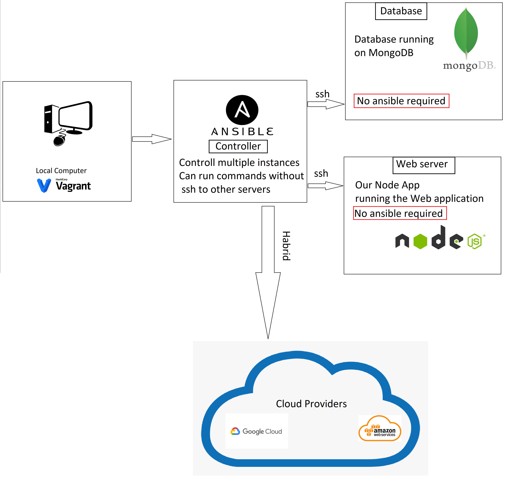

# Ansible
Ansible Acts as a controller to other instances. Ansible is an automated engine that automates provisioning configuration management, application deployment and many other processes.
Ansible can be installed on Red Hat Enterprise Linux, CentOS, or Fedora; Ubuntu; Debian making it really flexible.
## what is Iac
Infrastructure as code (IaC) uses DevOps methodology and versioning with a descriptive model to define and deploy infrastructure, such as networks, virtual machines, load balancers, and connection topologies. Just as the same source code always generates the same binary, an IaC model generates the same environment every time it deploys.</br>
The benefits of Iac is that it can create instances with the correct modules and requirement it needs to run the softwares, this is similar to docker images or IMA images in aws.

### Blue green deployment
It used for upgrade or updates in applications. It is used when you don't want any downtime when deploying new features or updates to a server.

## setup for ansible
1. SSH into Controller VM
2. Run Update and Upgrade
3. Run `sudo apt-get install software-properties-common`
4. Run `sudo apt-add-repository ppa:ansible/ansible`
5. Run `Sudo apt-get update`
6. Run `sudo apt-get install ansible -y`
7. Check `sudo apt-get install tree `
8. cd into `cd /etc`
9. cd into `cd ansible/`
10. pwd = /etc/ansible
11. Now we want to ssh into web vm from insode the controller vm
12. Enter `sudo ssh vagrant@192.168.33.10` enter then password `vagrant`
13. you should now be inside the web vm
14. To return back to controller enter `exit`
15. Now we want to ssh into web db from insode the controller vm
16. Enter `sudo ssh vagrant@192.168.33.10` enter then password `vagrant`
we can automated this be going inside the hosts file
17. sudo nano hosts - now we can edit and some example are there
18. for this case `[web]`; in a new line `192.168.33.10 ansible_connection=ssh ansible_ssh_user=vagrant ansible_ssh_pass=vagrant`
19. now we can quickly connect to these servers/VM using the command `sudo ansible -m ping web` which if success, it will come back in green with a "pong"
20. to run command inside other Vm without ssh, we run the command `sudo ansible web -a "command"` and the output will be shown in the controller output
21. The power of ansible comes when we want to control multiple VMs, in ansible, we can control multiple commands to be set on other servers automatically without the need to ssh into them. by writing `sudo ansible all -a "sudo apt update"` we can run update on all the VM we have inside our /etc/ansible/**hosts** file
22. copy files using the ad-hoc command `ansible atlanta -m ansible.builtin.copy -a "src=/etc/hosts dest=/tmp/hosts"`
23. incase of any syntax error, you can run `sudo ansible-playbook configure_nginx.yml --syntax-check` and it will check any error in the file and tell you what line 

## What is ansible roles
Ansible allows to make groups and inside groups, add automation, configuration, files, templates, tasks that they can inherit by groups
```
# Yaml file start
---
# create a script to configure nginx in our web server
# who how is the host - means name of the server
- hosts: web
# gather data
  gather_facts: yes
# we need admin acces
  become: true
# add the actual instruction
  tasks:
  - name: install/configure Nginx web server in web-VM
    apt: pkg=nginx state=present
# we need to ensure at the end of this script the status of nginx is running
```

## Hybrid ansible

1. install python3 `sudo apt install python3`
2. install pip `sudo apt install python3-pip`
3. install awscli `pip3 install awscli`
4. install boto3 `pip3 install boto boto3
5. alias `alias python=python3`
6. create folders in asible for pwd=`/etc/ansible/group_vars/all`
7. create a vault for aws access_keys etc/ `sudo ansible-vault pass.yml`
8. make it readable with `sudo chmod 666 pass.yml`
9. make a `eng130.pub` and `eng130` using `ssh-keygen -t rsa -b 4096 -f ~/.ssh/eng130` and make it private with `sudo chmod 600 ~/.ssh/eng130.pem` only if you get a "private key too accessible"
10. make ec2 `sudo ansible-playbook ec2.yml --ask-vault-pass --tags create-ec2`
11. inside the host add `[aws]` /n `ec2-instance ansible_host=ec2-ip ansible_user=ubuntu ansible_ssh_private_key_file~/.ssh/eng130.pem`
12. also for python3 `[local]` /n `localhost ansible_python_interpreter=/usr/bin/python3`

# IaC Orchestration with Terraform
founder by Do Kwon, owner and CEO of terraform open source, Terraform is an IAC tool that can automated various infrastructure written in the Go language. it allows you to describe your complete infrastructure in the form of code, with any cloud providers and be utilized by any of them. One of the main causes for terraform is for public cloud provisioning. Another use case is for facilitate multi-cloud deployment. In general, Terraform helps manage your entire IT ecosystem via IaC, whether it’s a single cloud, multi-cloud, or custom deployment.